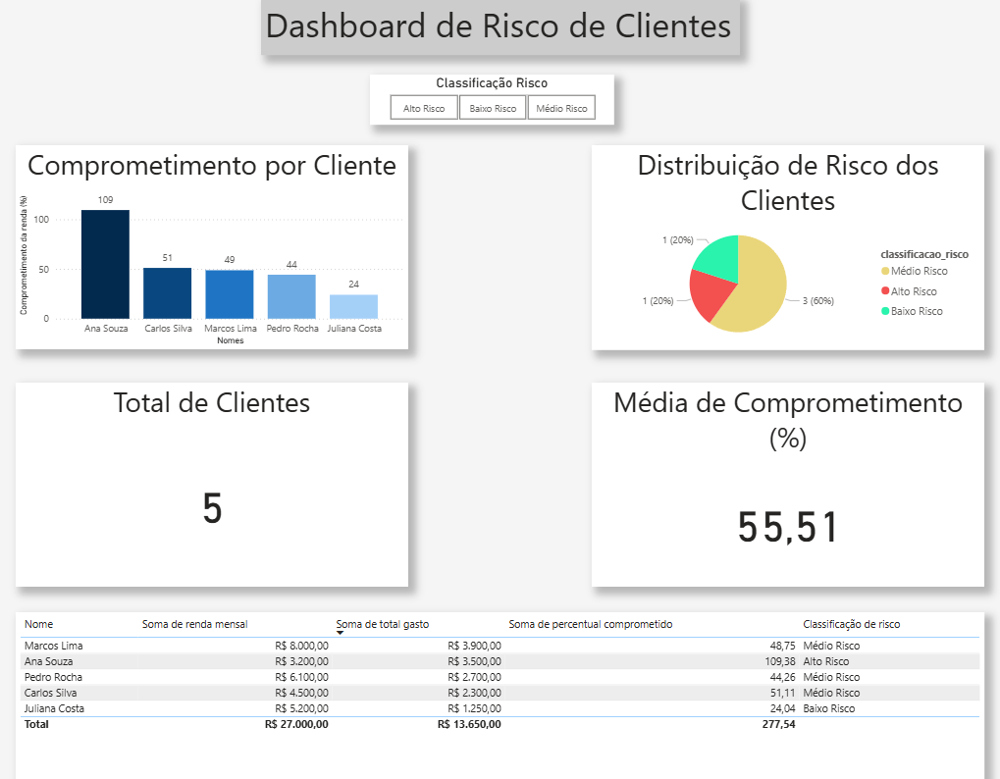

# Dashboard de Risco Financeiro de Clientes

Projeto desenvolvido para analisar o comprometimento da renda de clientes e classifica-los por nivel de risco financeiro. A proposta foi simular um cenario de analise de credito, transformando dados relacionais em indicadores visuais para apoiar decisoes de negocio.

## Objetivo

Medir quanto da renda de cada cliente esta comprometida com gastos e, a partir disso, identificar perfis de baixo, medio e alto risco.

## Ferramentas utilizadas

- PostgreSQL
- SQL
- Power BI
- pgAdmin / DBeaver

## Estrutura dos dados

A base foi organizada em tres tabelas principais:

- `clientes`: informacoes cadastrais e renda mensal
- `transacoes`: gastos realizados pelos clientes
- `categorias`: classificacao dos tipos de gasto

## Tratamento e modelagem

Para consolidar a analise, foi criada a view `vw_analise_risco`, responsavel por:

- unir os dados das tabelas
- calcular o total gasto por cliente
- calcular o percentual de renda comprometida
- entregar uma base pronta para visualizacao no Power BI

## Regra de negocio

Os clientes foram classificados conforme o percentual de comprometimento da renda:

- **Baixo risco:** ate 30%
- **Medio risco:** entre 30% e 60%
- **Alto risco:** acima de 60%

## Dashboard

O dashboard foi construido no Power BI com os seguintes elementos:

- grafico de barras com o comprometimento por cliente
- grafico de pizza com a distribuicao por faixa de risco
- cartoes com total de clientes e media de comprometimento
- filtro por classificacao de risco
- tabela com visao detalhada dos dados

## Preview do dashboard

## O que a analise permite visualizar

- quais clientes apresentam maior risco financeiro
- como o risco esta distribuido na base
- o nivel medio de comprometimento da renda
- uma visao de apoio para decisoes relacionadas a credito e cobranca

## Arquivos do projeto

- `dashboard_risco_clientes.pbix`
- `sql/01_schema.sql`
- `sql/02_inserts.sql`
- `sql/03_view_vw_analise_risco.sql`

## Scripts SQL

Os scripts SQL foram organizados para facilitar a reproducao do projeto:

- `01_schema.sql`: criacao das tabelas
- `02_inserts.sql`: carga de dados de exemplo
- `03_view_vw_analise_risco.sql`: criacao da view utilizada no Power BI

## Resumo para curriculo

**Projeto de Analise de Risco Financeiro com Power BI**

Desenvolvimento de dashboard interativo utilizando SQL e Power BI para analise de comprometimento de renda e classificacao de risco de clientes.
